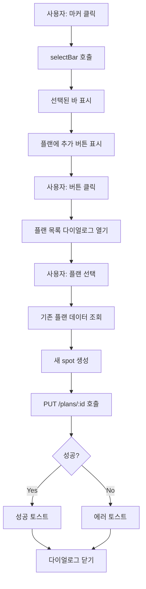

지도 장소 클릭 시 플랜에 추가 기능 구현
목표
/home 페이지의 지도에서 장소(마커)를 클릭하면:

플랜 선택 다이얼로그 표시
사용자가 플랜 선택
선택한 플랜에 해당 장소를 spot으로 자동 추가
현재 구조 분석
HomePage.vue
마커 클릭 시: @click="selectBar(bar)"
selectBar
함수: 현재는 selectedBarId만 설정하고 지도 이동
BarListItemDto
: id, name, address, latitude, longitude 등 포함
필요한 작업
마커에 "플랜에 추가" 버튼 추가
버튼 클릭 시 플랜 목록 다이얼로그 표시
플랜 선택 후 해당 플랜에 spot 추가 API 호출
구현 계획

1. HomePage.vue 수정
A) 플랜 선택 다이얼로그 추가
<Dialog 
  v-model:visible="showPlanDialog" 
  header="플랜에 추가"
  :modal="true"
>
  <!-- 플랜 목록 표시 -->
  <!-- 플랜 선택 버튼 -->
</Dialog>
B) 상태 추가
const showPlanDialog = ref(false)
const selectedBarForAdd = ref<BarListItemDto | null>(null)
const userPlans = ref<Plan[]>([])
const addingToPlan = ref(false)
C) 마커 클릭 핸들러 수정
기존 
selectBar
는 유지하고, 새로운 "플랜에 추가" 액션 추가:

마커 클릭 시 인포윈도우 또는 버튼 표시
버튼 클릭 시 openPlanDialog(bar) 호출
D) 플랜 목록 로드
const loadUserPlans = async () => {
const res = await PlanApi.listPlans()
if (res.ok) {
userPlans.value = normalizePlans(res.data)
}
}
E) 플랜에 spot 추가
const addBarToPlan = async (planId: number) => {
if (!selectedBarForAdd.value) return

// 기존 플랜 데이터 가져오기
const planRes = await PlanApi.getPlanDetail(planId)
if (!planRes.ok) {
toast.add({ severity: 'error', summary: '플랜 조회 실패', life: 3000 })
return
}

const plan = planRes.data
const existingSpots = plan.spots || []

// 새 spot 생성
const newSpot: PlanSpot = {
placeId: selectedBarForAdd.value.id,
placeNameSnapshot: selectedBarForAdd.value.name,
placeAddressSnapshot: selectedBarForAdd.value.address,
latitude: selectedBarForAdd.value.latitude,
longitude: selectedBarForAdd.value.longitude,
sequence: existingSpots.length + 1,
memo: ''
}

// PUT 요청으로 업데이트
const updateRes = await PlanApi.updatePlan(planId, {
spots: [...existingSpots, newSpot]
})

if (updateRes.ok) {
toast.add({ severity: 'success', summary: '플랜에 추가되었습니다', life: 3000 })
showPlanDialog.value = false
} else {
toast.add({ severity: 'error', summary: '추가 실패', life: 3000 })
}
} 2. UI 개선 옵션
옵션 A: 마커 클릭 시 인포윈도우 표시
NaverInfoWindow 사용
"플랜에 추가" 버튼 표시
옵션 B: 선택된 바에 액션 버튼 추가
기존 selectedBar 표시 영역에 버튼 추가
더 간단하고 직관적
권장: 옵션 B (더 간단)

구현 파일
수정할 파일
HomePage.vue
필요한 import
import Dialog from 'primevue/dialog'
import { PlanApi } from '@/api/plan/planApi'
import type { Plan, PlanSpot } from '@/api/plan/types'

## 상세 구현 흐름

1. 기능 테스트
   마커 클릭 → 바 선택 확인
   "플랜에 추가" 버튼 표시 확인
   버튼 클릭 → 다이얼로그 열림 확인
   플랜 목록 표시 확인
   플랜 선택 → spot 추가 → 성공 메시지 확인
2. 에러 처리
   플랜이 없을 때 처리
   API 실패 시 에러 메시지 표시
   중복 추가 방지 (선택 사항)
3. UX
   로딩 인디케이터 표시
   성공/실패 피드백
   다중 클릭 방지

---
