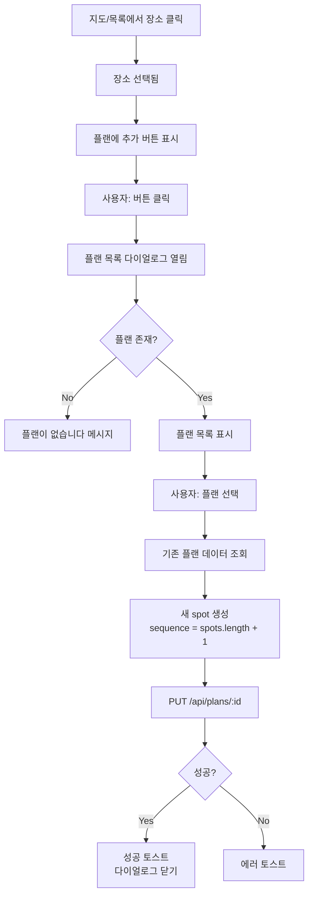

# 지도 장소 클릭 시 플랜에 추가 기능 구현 완료

**작성일**: 2025-12-23  
**작업**: 지도 장소 → 플랜 추가 기능 구현

---

## 📋 구현 요약

/home 페이지의 지도에서 장소를 클릭하면 플랜 선택 다이얼로그가 나타나고, 선택한 플랜에 해당 장소가 자동으로 spot으로 추가되는 기능을 구현했습니다.

---

## ✅ 구현된 기능

### 1. 선택된 바에 "플랜에 추가" 버튼 추가
- 사이드 패널 하단의 선택된 바 영역에 버튼 표시
- 버튼 클릭 시 플랜 선택 다이얼로그 오픈

### 2. 플랜 선택 다이얼로그
- 사용자의 모든 플랜 목록 표시
- 각 플랜의 제목, 설명, 테마, spots 수 표시
- 플랜이 없을 경우 안내 메시지
- 플랜 클릭 시 해당 플랜에 장소 추가

### 3. 플랜에 spot 추가 로직
- 기존 플랜 데이터 조회 (`getPlanDetail`)
- 새 spot 객체 생성 (sequence는 기존 spots 길이 + 1)
- PUT API로 업데이트 (`updatePlan`)
- 성공/실패 토스트 메시지 표시

---

## 🔧 수정된 파일

### [HomePage.vue](file:///Users/sungjinkim/IdeaProjects/anti/client/src/views/HomePage.vue)

**추가된 import:**
```typescript
import Dialog from 'primevue/dialog'
import { PlanApi } from '@/api/plan/planApi'
import type { Plan, PlanSpot } from '@/api/plan/types'
```

**추가된 상태:**
```typescript
const showPlanDialog = ref(false)
const selectedBarForAdd = ref<BarListItemDto | null>(null)
const userPlans = ref<Plan[]>([])
const addingToPlan = ref(false)
```

**추가된 함수:**
- `loadUserPlans()`: 사용자 플랜 목록 조회
- `openPlanDialog(bar)`: 플랜 선택 다이얼로그 열기
- `addBarToPlan(planId)`: 플랜에 spot 추가

---

## 🎯 사용자 플로우



---

## 🧪 테스트 방법

### 1. 기본 플로우
1. http://localhost:5173/home 접속
2. 지도에서 원하는 술집 마커 클릭
3. 사이드 패널 하단에 "플랜에 추가" 버튼 확인
4. 버튼 클릭
5. 플랜 선택 다이얼로그 확인
6. 플랜 클릭
7. 성공 토스트 메시지 확인

### 2. Edge Cases
- **플랜이 없는 경우**: "플랜이 없습니다" 메시지 표시
- **API 실패**: 에러 토스트 표시
- **중복 추가**: 현재는 중복 체크 없이 추가됨 (필요시 추가 가능)

---

## 📊 주요 코드

### 플랜에 장소 추가 로직

```typescript
const addBarToPlan = async (planId: number) => {
  if (!selectedBarForAdd.value) return

  addingToPlan.value = true

  try {
    // 1. 기존 플랜 조회
    const planRes = await PlanApi.getPlanDetail(planId)
    if (!planRes.ok) {
      errToast('플랜 조회 실패', planRes.error.message || '')
      return
    }

    const plan = planRes.data
    const existingSpots = plan.spots || []

    // 2. 새 spot 생성
    const newSpot: PlanSpot = {
      placeId: selectedBarForAdd.value.id,
      placeNameSnapshot: selectedBarForAdd.value.name,
      placeAddressSnapshot: selectedBarForAdd.value.address,
      latitude: selectedBarForAdd.value.latitude,
      longitude: selectedBarForAdd.value.longitude,
      sequence: existingSpots.length + 1,
      memo: '',
    }

    // 3. PUT API로 업데이트
    const updateRes = await PlanApi.updatePlan(planId, {
      spots: [...existingSpots, newSpot],
    })

    if (updateRes.ok) {
      toast.add({
        severity: 'success',
        summary: '플랜에 추가되었습니다',
        detail: `"${selectedBarForAdd.value.name}"이(가) "${plan.title}"에 추가되었습니다.`,
        life: 3000,
      })
      showPlanDialog.value = false
    } else {
      errToast('플랜 추가 실패', updateRes.error.message || '')
    }
  } finally {
    addingToPlan.value = false
  }
}
```

---

## 🚀 향후 개선 사항 (선택)

1. **중복 체크**: 이미 추가된 장소인지 확인
2. **로딩 인디케이터**: 다이얼로그에서 플랜 추가 중 로딩 표시
3. **순서 변경**: 추가된 spot의 sequence를 사용자가 직접 지정
4. **메모 입력**: 장소 추가 시 메모를 함께 입력할 수 있는 UI
5. **새 플랜 생성**: 다이얼로그에서 바로 새 플랜 생성 가능

---

**구현 완료!** 🎉
